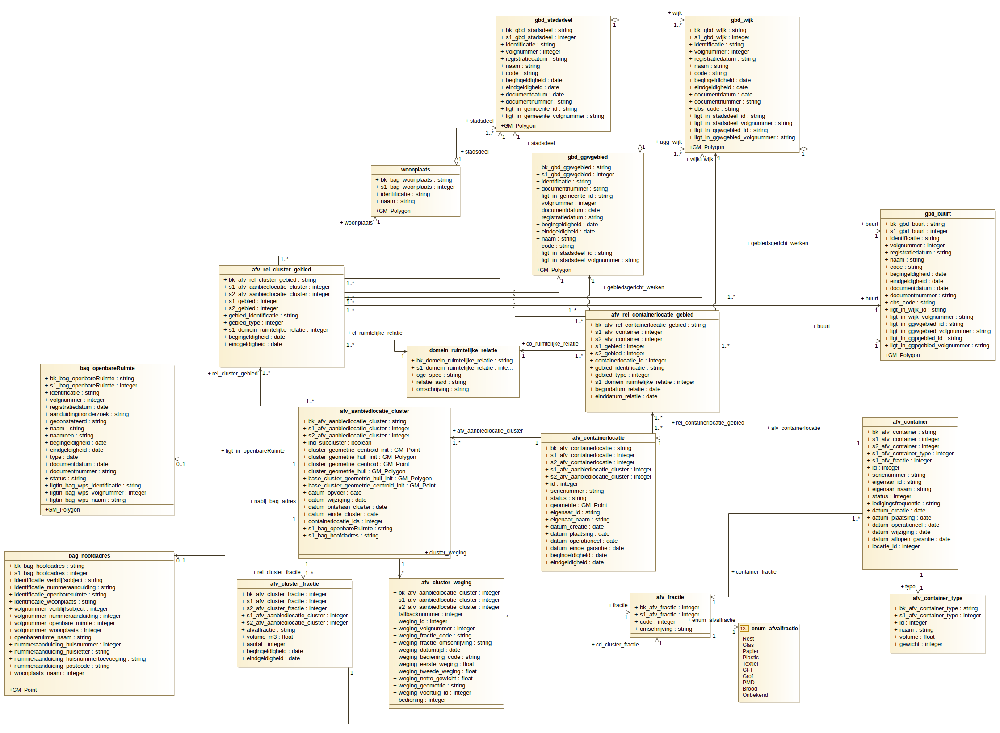

# logisch gegevensmodel

Het onderstaande gegevensmodel representeert de samenhang tussen objectklassen uit het domein afval en gerelateerde entiteiten. Dit model vormt de basis van alle dataproducten die hieruit (kunnen) worden afgeleid.
De samenhang tussen de objecten is gebaseerd op basis van thematische voorwaarden, ruimte en tijd (historie).

[Logisch model inzameling huishoudelijk afval](afb/afvalinzameling_integratie.png)
