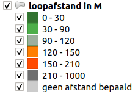
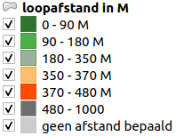

# Kaartlagen op data.amsterdam.nl

Een deel van de gegevens betreffende ondergronds afvalcontainers zijn opgenomen in de kaart van data.amsterdam.nl
De volgende kaarlagen zijn beschikbaar.

## afvalcontainers

| **kaartlaag**                        | opmerking                                                             |
|--------------------------------------|-----------------------------------------------------------------------|
| Restafval                            | bestaand                                                              |
| Papier                               | bestaand                                                              |
| Glas                                 | bestaand                                                              |
| Plastic                              | bestaand                                                              |
| Textiel                              | bestaand                                                              |
| GFE                                  | bestaand                                                              |
| Brood                                | nieuw                                                                 |

## afval loopafstanden pand

| **kaartlaag**                        | opmerking                                                             |
|--------------------------------------|-----------------------------------------------------------------------|
| Restafval [0-30-90-120-150-210-1000] | Zie uitwerking afstandsklassen, nog valideren met frequentieverdeling |
| Papier  [0-30-90-120-150-210-1000]   | Zie uitwerking afstandsklassen, nog valideren met frequentieverdeling |
| Glas  [0-30-90-120-150-210-1000]     | Zie uitwerking afstandsklassen, nog valideren met frequentieverdeling |
| Plastic  [0-30-90-120-150-210-1000]  | Zie uitwerking afstandsklassen, nog valideren met frequentieverdeling |
| Textiel  [0-90-180-350-370-480-1000]     | Zie uitwerking afstandsklassen, nog valideren met frequentieverdeling |

## Attributen kaartlaag afvalcontainers

| attribuut          | omschrijving                                                                 | categorie             |
|--------------------|------------------------------------------------------------------------------|-----------------------|
| container_id       | Uniek identificerend kenmerk van het object                                  | metadata              |
| cluster_id         | Uniek identificerend kenmerk van cluster waaraan de container is gerelateerd | metadata              |
| datum_plaatsing    | Datum waarop het object op de locatie is geplaatst                           | metadata              |
| datum_operationeel| Datum dat de container operationeel is voor het aanbieden van afval          | metadata              |
| afvalfractie       | Type afvalfractie waarvoor de container is bedoeld                           | functioneel attribuut |
| volume_container   | inhoud container in m3                                                       | functioneel attribuut |
| container_type     | type container volgens de fabricant                                          | functioneel attribuut |
| container_status   | Status van de container {0 - inactief ,1 - actief ,2 - gepland}              | functioneel attribuut |

Opmerking:
De inactieve en geplande containers niet opnemen en weergeven voor publiek.
Voor ambtenaren mogen de inactieve en geplande containers wel zichtbaar zijn in een aparte laag.

## Attributen loopafstanden pand

| attribuut          | omschrijving                                                                 | categorie             |
|--------------------|------------------------------------------------------------------------------|-----------------------|
| object_id          | Uniek identificerend kenmerk van het object                                  | metadata              |
| cluster_id         | Uniek identificerend kenmerk van cluster waaraan de container is gerelateerd | metadata              |
| peildatum_gegevens | datum afleiding loopafstand                                                  | metadata              |
| object_type        | type obect {pand, ligplaats, standplaats}                                    | functioneel attribuut |
| afvalfractie       | Type afvalfractie waarvoor de container is bedoeld                           | functioneel attribuut |
| loopafstand        | berekende afstand over de weg in meters naar meest nabije container          | functioneel attribuut |

## Indeling loopafstanden
Uiteraard bestaat er variatie in de loopafstanden. Deze afstanden zijn verdeel in zgn. klassen.
De onderstaande geeft de indeling van deze klassen weer.

**Voor de afvalfracties restafval, papier, glas en plastic**

| categorie_omschrijving | categorie_afstand_vanaf | categorie_afstand_tot | Kleur htmlcode |
|------------------------|-------------------------|-----------------------|----------------|
| -                      | 0                       | 30                    | #327230 |
| -                      | 30                      | 90                    | #4daf4a |
| -                      | 90                      | 120                   | #9daf9d |
| -                      | 120                     | 150                   | #ff7f00 |
| Omslagpunt: 150M       | 150                     | 210                   | #ff4b00 |
| -                      | 210                     | 1000                  | #6e6e6e |
| -                      | null                    | null                  | #cccccc |

**Voor de afvalfractie textiel**
| categorie_omschrijving | categorie_afstand_vanaf | categorie_afstand_tot | Kleur htmlcode |
|------------------------|-------------------------|-----------------------|----------------|
| -                      | 0                       | 90                    | #327230 |
| -                      | 90                      | 180                   | #4daf4a |
| -                      | 180                     | 350                   | #9daf9d |
| Omslagpunt: 350 M      | 350                     | 370                   | #ff7f00 |
| -                      | 370                     | 480                   | #ff4b00 |
| -                      | 480                     | 1000                  | #6e6e6e |
| -                      | null                    | null                  | #cccccc |

## Voorstel van power users A&G
afstanden in meter (rest, glas, papier,plastic)  
0-30          heel donker groen  
30-60         donker groen  
60-90         groen  
90 120        licht groen  
120 150       lichter groen  
150 180       oranje  
180 210       rood  
meer dan 210  Grijs  
